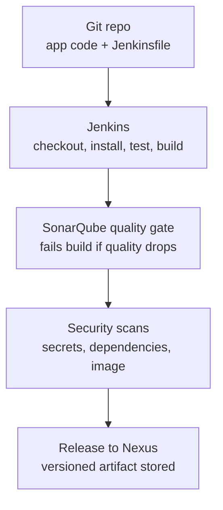
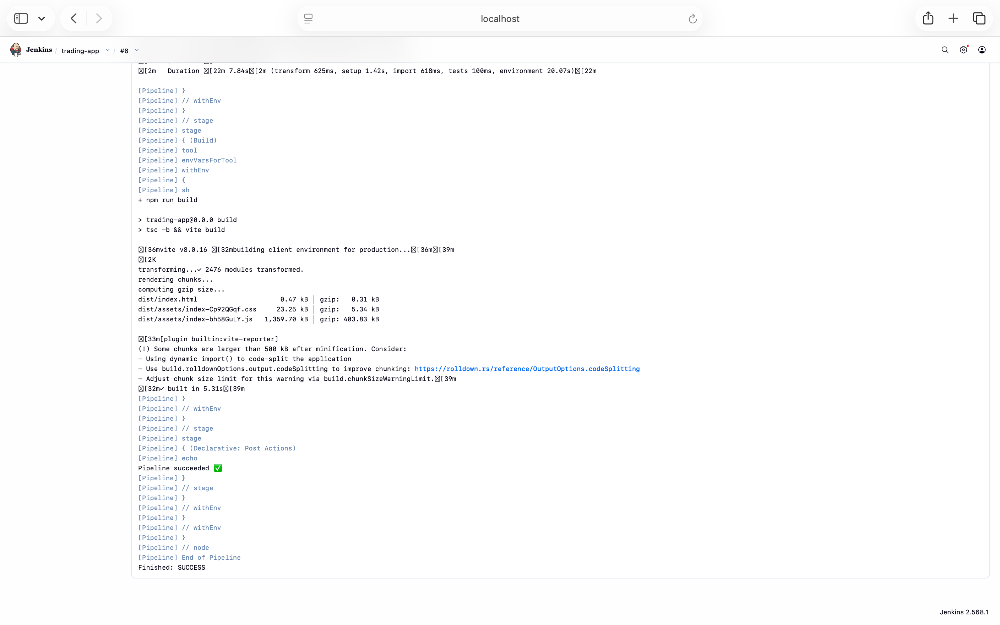

# Jenkins DevOps Stack

A self-hosted CI/CD platform built from scratch with **Jenkins**, **SonarQube**, and **Nexus**, running on Docker Compose. It runs a real pipeline that checks out a full-stack application from GitHub, installs dependencies, runs tests, and builds it for production.

This project exists to demonstrate hands-on DevOps skills end to end: **administering CI/CD platforms, writing pipeline-as-code, and automating build, test, and release** — not by following a managed service, but by running and owning the infrastructure directly.

> **Note on scope:** this repository is the CI/CD _platform_. The application it builds ([`trading-app`](https://github.com/rex-daworker/trading-app)) lives in its own repository, with the `Jenkinsfile` committed there — mirroring how a real platform team and product teams work.

---

## Architecture



The stack runs three services locally via Docker Compose:

| Service   | Role                                   | URL                   |
| --------- | -------------------------------------- | --------------------- |
| Jenkins   | CI/CD orchestrator — runs the pipeline | http://localhost:8080 |
| SonarQube | Code quality analysis + quality gate   | http://localhost:9000 |
| Nexus     | Artifact repository (release storage)  | http://localhost:8081 |

---

## Quick start

```bash
# 1. Clone and enter the project
git clone https://github.com/rex-daworker/jenkins-devops-stack.git
cd jenkins-devops-stack

# 2. Bring up the stack
docker compose up -d

# 3. Get the Jenkins initial admin password
docker compose logs jenkins | grep -A 2 "Please use the following password"
```

Then open http://localhost:8080, unlock Jenkins with that password, install the suggested plugins, and create an admin user.

### `docker-compose.yml`

```yaml
services:
  jenkins:
    image: jenkins/jenkins:lts
    user: root
    ports:
      - "8080:8080"
      - "50000:50000"
    volumes:
      - jenkins_home:/var/jenkins_home
      - /var/run/docker.sock:/var/run/docker.sock
    restart: unless-stopped

  sonarqube:
    image: sonarqube:lts-community
    ports:
      - "9000:9000"
    volumes:
      - sonar_data:/opt/sonarqube/data
      - sonar_exts:/opt/sonarqube/extensions
    restart: unless-stopped

  nexus:
    image: sonatype/nexus3
    ports:
      - "8081:8081"
    volumes:
      - nexus_data:/nexus-data
    restart: unless-stopped

volumes:
  jenkins_home:
  sonar_data:
  sonar_exts:
  nexus_data:
```

---

## The pipeline

The pipeline is defined as code in a `Jenkinsfile` committed to the application repository. Node.js is provided through a configured Jenkins **NodeJS tool** (`node20`), so builds are reproducible and don't depend on what's installed on the host.

```groovy
pipeline {
  agent any
  tools { nodejs 'node20' }
  stages {
    stage('Install') { steps { sh 'npm ci' } }
    stage('Test')    { steps { sh 'npm test -- --run || echo "no tests yet"' } }
    stage('Build')   { steps { sh 'npm run build' } }
  }
  post {
    success { echo 'Pipeline succeeded ✅' }
    failure { echo 'Pipeline failed.' }
  }
}
```

A successful run checks out the repository, installs dependencies with `npm ci`, runs the test suite, and produces a production build (2,476 modules transformed) — completing in about 1 minute 22 seconds.

---

## Screenshots

<!-- Save each screenshot into a docs/images/ folder using the filenames below. -->

**1. The full stack running (Jenkins, SonarQube, Nexus started via Docker Compose)**


**2. Jenkins ready after setup**


**3. Successful pipeline build**


**4. Console output — pipeline succeeded**



---

## Roadmap

- [x] **Phase 1 — Stack up:** Jenkins, SonarQube, and Nexus running on Docker Compose
- [x] **Phase 2 — First pipeline:** multi-stage build (checkout → install → test → build) against a real app
- [ ] **Phase 3 — Quality & security gates:** SonarQube quality gate + `gitleaks`, `npm audit`, and Trivy scans that fail the build on issues
- [ ] **Phase 4 — Release:** publish versioned build artifacts to Nexus
- [ ] **Phase 5 — Robustness:** Jenkins Configuration as Code (JCasC), a multibranch pipeline with webhook triggers, and a dedicated build agent

---

## What this demonstrates

- Standing up and **administering** a CI/CD platform (Jenkins) alongside supporting DevOps tooling (SonarQube, Nexus)
- **Pipeline-as-code** with a declarative `Jenkinsfile`
- **Build automation** on Linux, in containers, with reproducible toolchains
- Real-world debugging: resolving missing runtimes, agent configuration, and Docker integration to reach a passing build

## Security notes

- No secrets are committed to this repository. Application configuration (API keys, credentials) is supplied at runtime and kept out of version control.
- Jenkins credentials are stored in Jenkins' built-in credential store and referenced by ID — never hard-coded in the `Jenkinsfile`.

---

_Built by [rex-daworker](https://github.com/rex-daworker) — a cloud-native full-stack developer who builds applications and ships the infrastructure they run on._
