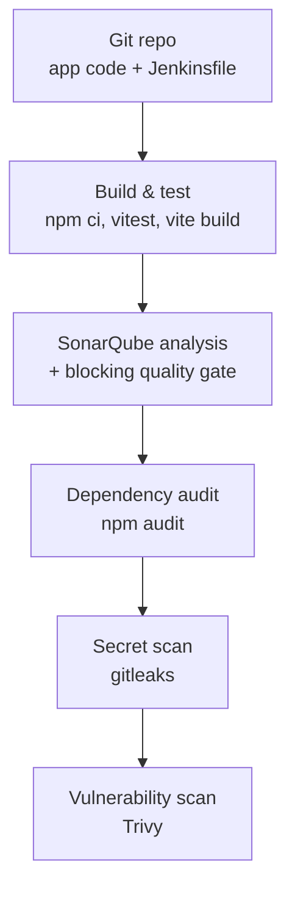
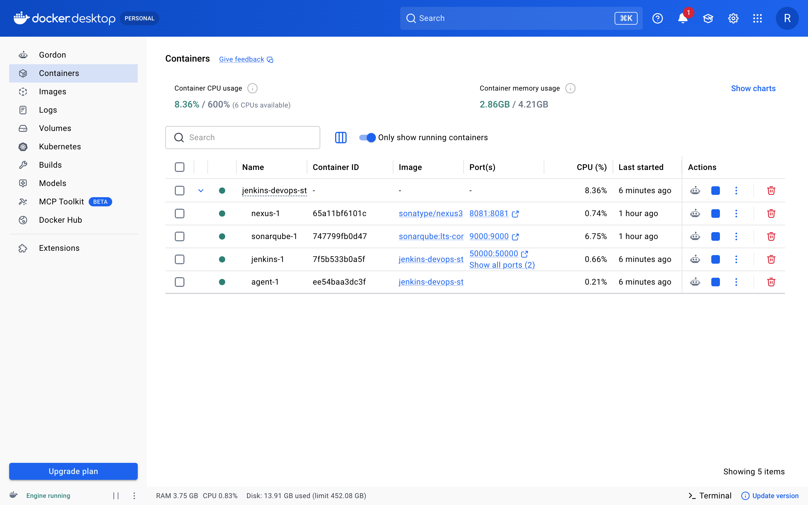
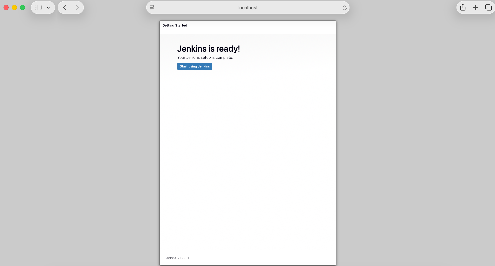
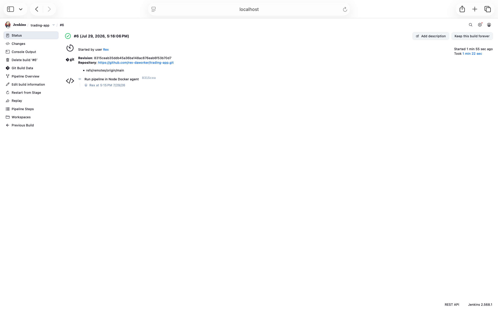
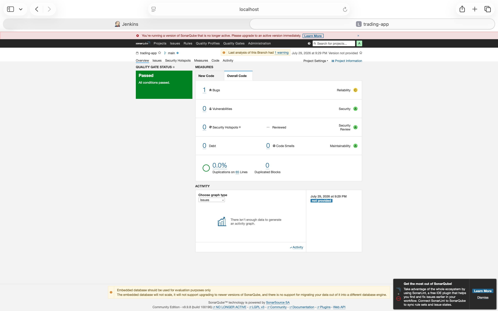
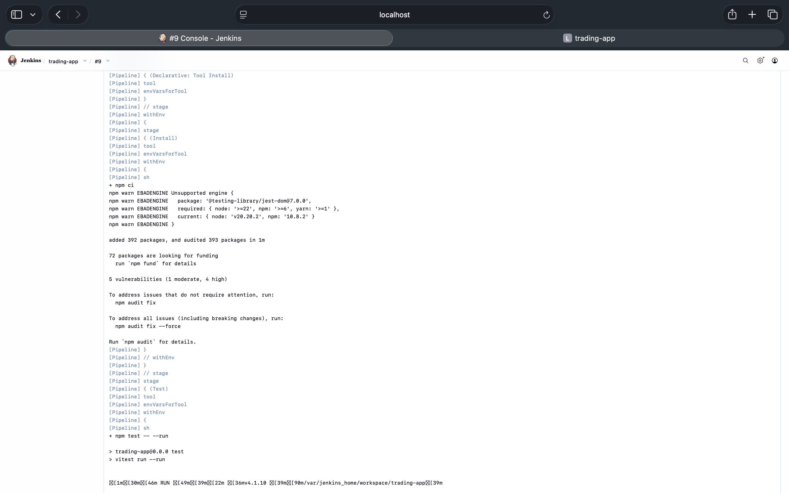
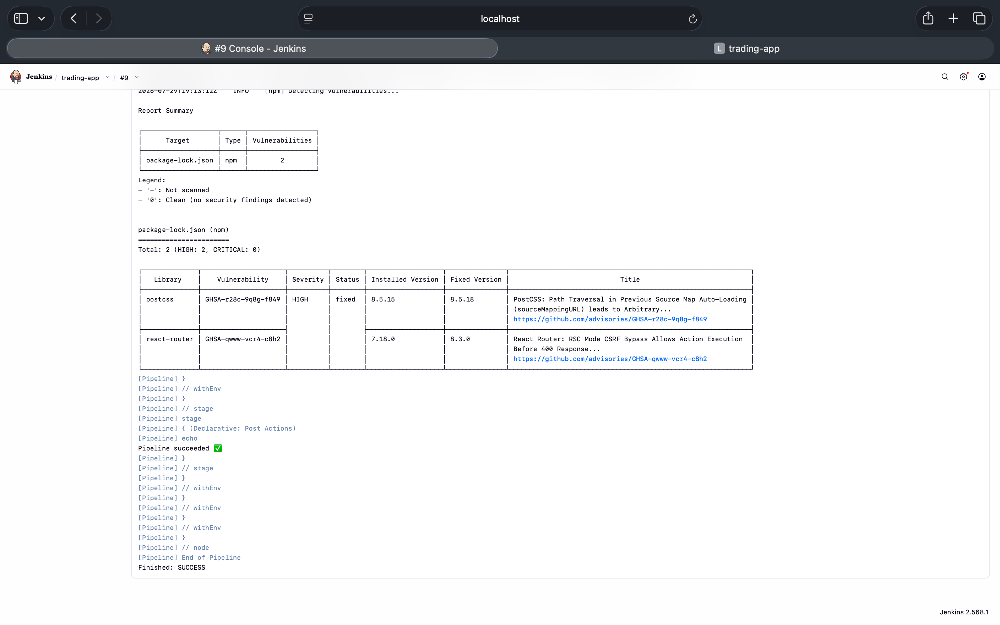

# Jenkins DevOps Stack

A self-hosted CI/CD platform built from scratch with **Jenkins**, **SonarQube**, and **Nexus**, running on Docker Compose. It runs a real, security-hardened pipeline that checks out a full-stack application from GitHub, tests and builds it, enforces a code-quality gate, and scans it for secrets and vulnerabilities.

This project demonstrates hands-on DevOps skills end to end: **administering CI/CD platforms, writing pipeline-as-code, and automating build, test, quality, and security** — not by following a managed service, but by running and owning the infrastructure directly.

> **Note on scope:** this repository is the CI/CD _platform_. The application it builds ([`trading-app`](https://github.com/rex-daworker/trading-app)) lives in its own repository, with the `Jenkinsfile` committed there — mirroring how a real platform team and product teams work.

---

## Architecture



The stack runs three services locally via Docker Compose:

| Service   | Role                                   | URL                   |
| --------- | -------------------------------------- | --------------------- |
| Jenkins   | CI/CD orchestrator — runs the pipeline | http://localhost:8080 |
| SonarQube | Code quality analysis + quality gate   | http://localhost:9000 |
| Nexus     | Artifact repository                    | http://localhost:8081 |

Jenkins is built from a small custom image (`jenkins/Dockerfile`) that adds the Docker CLI, so the pipeline can run containerized security scanners (gitleaks, Trivy) against the workspace.

---

## Quick start

```bash
git clone https://github.com/rex-daworker/jenkins-devops-stack.git
cd jenkins-devops-stack
docker compose up -d --build
docker compose logs jenkins | grep -A 2 "Please use the following password"
```

Open http://localhost:8080, unlock Jenkins with that password, install the suggested plugins, and create an admin user.

---

## The pipeline

Defined as code in a `Jenkinsfile` in the application repository. Node.js is provided through a configured Jenkins **NodeJS tool** (`node20`) so builds are reproducible.

| Stage                  | What it does                                                                                   |
| ---------------------- | ---------------------------------------------------------------------------------------------- |
| **Install**            | `npm ci` — clean dependency install                                                            |
| **Test**               | Vitest suite (10 tests)                                                                        |
| **Build**              | Production build (`tsc -b && vite build`)                                                      |
| **SonarQube analysis** | Full static code-quality scan                                                                  |
| **Quality Gate**       | `waitForQualityGate abortPipeline: true` — **fails the build** if quality drops below the gate |
| **Dependency audit**   | `npm audit` — flags known-vulnerable dependencies                                              |
| **Secret scan**        | gitleaks — scans the workspace for committed secrets                                           |
| **Vulnerability scan** | Trivy — scans dependencies for HIGH/CRITICAL CVEs                                              |

```groovy
pipeline {
  agent any
  tools { nodejs 'node20' }
  environment { SCANNER_HOME = tool 'sonar-scanner' }
  stages {
    stage('Install') { steps { sh 'npm ci' } }
    stage('Test')    { steps { sh 'npm test -- --run || echo "no tests yet"' } }
    stage('Build')   { steps { sh 'npm run build' } }
    stage('SonarQube analysis') {
      steps {
        withSonarQubeEnv('sonarqube') {
          sh "\${SCANNER_HOME}/bin/sonar-scanner -Dsonar.projectKey=trading-app -Dsonar.sources=src"
        }
      }
    }
    stage('Quality Gate') {
      steps {
        timeout(time: 5, unit: 'MINUTES') {
          waitForQualityGate abortPipeline: true
        }
      }
    }
    stage('Dependency audit') {
      steps { sh 'npm audit --audit-level=high || true' }
    }
    stage('Secret scan') {
      steps {
        sh 'docker run --rm -v jenkins-devops-stack_jenkins_home:/jhome zricethezav/gitleaks:latest detect --source=/jhome/workspace/trading-app --no-git -v || true'
      }
    }
    stage('Vulnerability scan') {
      steps {
        sh 'docker run --rm -v jenkins-devops-stack_jenkins_home:/jhome aquasec/trivy:latest fs --severity HIGH,CRITICAL --scanners vuln /jhome/workspace/trading-app || true'
      }
    }
  }
  post {
    success { echo 'Pipeline succeeded ✅' }
    failure { echo 'Pipeline failed.' }
  }
}
```

---

## Screenshots

<!-- Save each screenshot into docs/images/ using the filenames below. -->

**1. The full stack running (Jenkins, SonarQube, Nexus via Docker Compose)**



**2. Jenkins ready after setup**



**3. Successful pipeline build**



**4. SonarQube quality gate passed**



**5. Dependency audit (npm audit) in the pipeline**



**6. Vulnerability scan (Trivy) results**



---

## Roadmap

- [x] **Phase 1 — Stack up:** Jenkins, SonarQube, and Nexus on Docker Compose
- [x] **Phase 2 — First pipeline:** multi-stage build against a real app
- [x] **Phase 3 — Quality & security gates:** SonarQube quality gate (blocking), `npm audit`, gitleaks secret scan, and Trivy vulnerability scan
- [ ] **Phase 4 — Release:** publish versioned build artifacts to Nexus
- [ ] **Phase 5 — Robustness:** Jenkins Configuration as Code (JCasC), multibranch pipeline with webhook triggers, dedicated build agent

---

## What this demonstrates

- Standing up and **administering** a CI/CD platform (Jenkins) with supporting DevOps tooling (SonarQube, Nexus)
- **Pipeline-as-code** with a declarative `Jenkinsfile`
- **Build automation** on Linux, in containers, with reproducible toolchains
- **Integrating code quality and security into the delivery pipeline** — a blocking SonarQube quality gate, dependency auditing, secret scanning, and CVE scanning, all automated
- Real-world debugging: resolving missing runtimes, agent configuration, Docker-in-Docker, and webhook integration to reach a fully green pipeline

## Security notes

- No secrets are committed to this repository, and the pipeline's gitleaks stage enforces that on every run.
- Jenkins credentials (e.g. the SonarQube token) are stored in Jenkins' built-in credential store and referenced by ID — never hard-coded.
- The pipeline surfaces real dependency CVEs (via `npm audit` and Trivy) so vulnerable packages are visible before release.

---

_Built by [rex-daworker](https://github.com/rex-daworker) — a cloud-native full-stack developer who builds applications and ships the infrastructure they run on._
